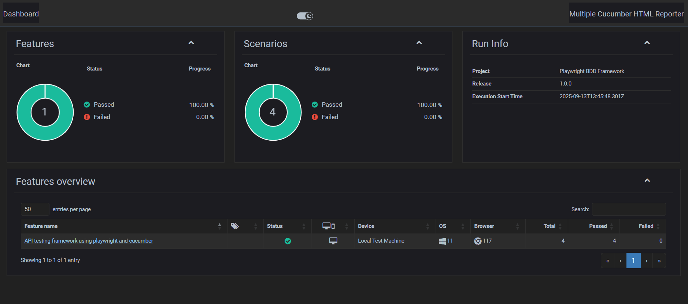
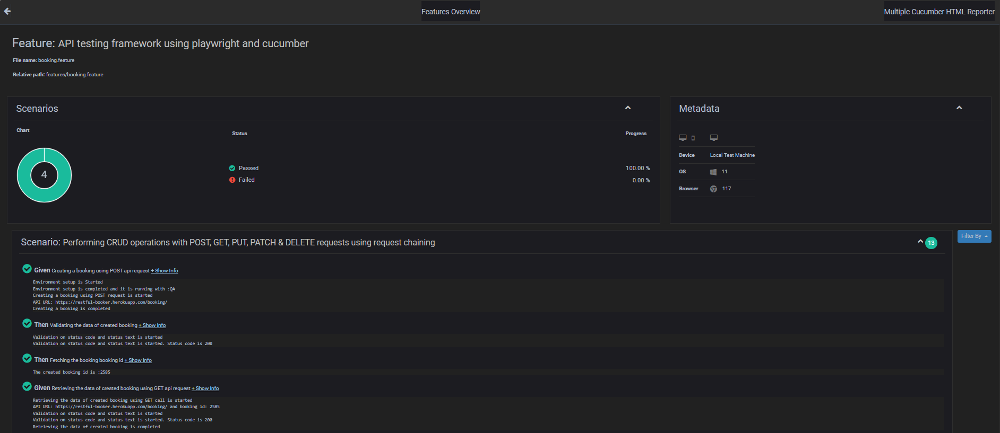

# API Testing using Playwright + Cucumber BDD Automation

> **Project:** `Book Store API testing` — Playwright + Cucumber (BDD) automation with HTML reporting and CI pipeline

---
## Introduction

This repository contains an automated test framework implemented using Playwright and Cucumber (BDD) in TypeScript. Tests can be executed locally and in CI (GitHub Actions). The pipeline generates an HTML report, zips it, uploads it as an artifact and attempts to email the zipped report.

## About this project & framework

* BDD-style feature files (`.feature`) are used to describe acceptance criteria which is human-readable feature files in Given–When–Then format.
* Step definitions and Base class and Page class are implemented in TypeScript using `@cucumber/cucumber` which link scenarios to API test logic.
* API automation powered by Playwright APIResponse and APIRequest contexts for REST API calls which covers positive, negative, and edge test cases.
* Data Driven Testing is Externalized payloads and test data under `testData/` and configuration file is under `config/`
* CI pipeline runs scheduled tests (cron Mon–Fri) and can be triggered manually via `workflow_dispatch`.
* Reports are produced using a custom `reporter.ts` (invoked by `npm run report`), and multiple-cucumber / html reporter packages are included in `devDependencies`.
📑 Sample Report Screenshots




## Tools & technologies used

Versions included in `package.json` (installed as devDependencies / dependencies):

* `@cucumber/cucumber` (BDD runner)
* `@playwright/test` and `playwright` (Playwright test tooling & browsers)
* `typescript`, `ts-node` (TypeScript execution)
* `cucumber-html-reporter`, `multiple-cucumber-html-reporter` (HTML reporters)
* `cross-env` (cross-platform env var handling)
* `dotenv` (load `.env` files)
* `zip` and GitHub Actions (for report artifact and upload)

> **Note:** exact versions are listed in `package.json` — keep those updated as needed. The workflow currently uses Node `14` (see `.github/workflows/*`). Adjust if your framework needs a newer Node version.

## Repository structure

```
├─ .github/workflows/            # CI workflow YAML(s)
├─ env                           # dotenv 
├─ features/                     # .feature files
├─ node modules                  # TS,playwright&cucumber packages
├─ reports                       # Reports for QA and Prod envs
├─ src/test/api
│  ├─ base                       # consists api request reusable functions like get,put,post,delete&patch.
│  ├─ config                     # api requests configurations
│  ├─ constants                  # test constants
│  ├─ feature                    # cucumber feature files
│  ├─ pages/                     # cucumber step definitions (.ts)
│  ├─ steps/                     # page objects
│  └─ support/                   # utilities (logging, world, helpers)
│  └─ testData                   # maintain datasets for different envs
├─ playwright.config.ts          # playwright configurations
├─ reporter.ts                   # custom report generator script
├─ cucumber-api.json             # cucumber-js config used in package.json test script
├─ package.json                  # dependencies
└─ tsconfig.json                 # Typescript configurations
```

## Prerequisites

* Node.js & npm (the workflow uses `node-version: '20'`). Locally: Node 14+ is fine, but if you use newer package releases you might need Node 16/18+. Use the Node version that matches your environment.
* Git
* Chromium/Firefox/WebKit browsers for Playwright (installed by `npx playwright install`)
* (If emailing reports) a valid SMTP username/password (e.g. Gmail app password) stored as a GitHub secret.

## Local setup & run instructions

> The project uses `npm ci` in CI to ensure deterministic installs. Locally you can use `npm install` or `npm ci`.

### Linux / macOS (bash)

1. Clone the repository:

```bash
git clone <repo-url>
cd ploaywright-qa-task1
```

2. Install dependencies:

```bash
npm ci
```

3. Install Playwright browsers (required once):

```bash
npx playwright install
```

4. Set environment variable (temporary for the shell) and run tests:

```bash
# temporary env for current shell only
export ENV=prod
# run cucumber tests (script from package.json)
npm test
```

Or use the package script that runs tests and report together:

```bash
npm run test:report
```

5. Generate the HTML report only (if you want to re-run the reporter):

```bash
npm run report
```

> If `npm run report` uses `ts-node reporter.ts`, ensure `reporter.ts` exists and is runnable. `ts-node` is included in `devDependencies`.

### Windows (PowerShell)

PowerShell sets env vars differently. The `package.json` currently contains a script named `env` with PowerShell syntax (`$env:ENV='prod'`) — but for consistent cross-platform behavior, prefer `cross-env` (see recommended improvements).

Temporary PowerShell env & run:

```powershell
$env:ENV = 'prod'
npm test
```

Or with `cross-env` (preferred, cross-platform):

```powershell
npx cross-env ENV=prod npm test
```

## CI / GitHub Actions pipeline

The repository includes a workflow file that runs scheduled Playwright tests and performs reporting steps. The workflow does the following (high-level):

### What the supplied workflow does (step-by-step)

1. **Trigger**

   * `schedule` with `cron: '30 2 * * 1-5'` — that executes at **02:30 UTC** which is **08:00 IST** (Mon–Fri). There is also `workflow_dispatch` for manual runs.

2. **Runs-on**: `ubuntu-latest` with a 60 minute timeout.

3. **Steps**:

   * Checkout the repo (`actions/checkout@v2`).
   * Setup Node.js (`actions/setup-node@v4`) with `node-version: '14'`.
   * Install npm deps using `npm ci`.
   * Install Playwright browsers via `npx playwright install`.
   * Set `ENV=prod` in the GitHub job environment via `echo "ENV=prod" >> $GITHUB_ENV`.
   * Run Playwright tests: `npx playwright test --with-deps` (this uses your Playwright test command — if this flag is not recognized in your setup, change to `npx playwright test`).
   * Generate the HTML report using `npm run report` (this runs `ts-node reporter.ts` with metadata params per `package.json`).
   * Zip the report folder into `playwright-report.zip`.
   * Upload the zipped artifact with `actions/upload-artifact@v4` (retention 30 days).
   * Send the zipped report via email using `dawidd6/action-send-mail@v3` with SMTP server credentials fetched from secrets.

## Environment variables & secrets

**In CI**:

* The workflow writes `ENV=prod` to `$GITHUB_ENV` (this makes `process.env.ENV === 'prod'` available to Node).
* The mail step expects `PASSWORD` (or in your workflow it uses `${{ secrets.EMAIL_PASSWORD }}`) — ensure you define this secret in the repository settings.

**For Gmail SMTP** (if using Gmail):

1. Enable 2‑factor authentication on the Gmail account.
2. Create an **App Password** in Google Account > Security (select *Mail* app, *Other* device) and copy the generated password.
3. Add the app password to your repo secrets as `EMAIL_PASSWORD`.

> **Security note:** Never commit credentials to source control. Use repo or org secrets.

## Report generation & artifacts

* `npm run report` runs `ts-node reporter.ts ...` (as configured in `package.json`). This should create an HTML report folder (the workflow expects `playwright-report`).
* The workflow zips `playwright-report` to `playwright-report.zip` and uploads it as an artifact.
* Download the artifact from the workflow run UI to view the zipped HTML files locally. Extract and open `index.html` in a browser.


✅ Summary

This framework enables:

      📊Cross-environment testing (QA & Prod)

      📊Readable BDD scenarios with Cucumber

      📊Robust API validations using Playwright

      📊Automated reporting & CI/CD integration

With this setup, QA and Dev teams can run, track, and share API test results with ease 🚀

## 👨‍💻 Contact / Maintainer
## Author:
## Satheesh Kumar Nedumaran
## Project Lead - Automation Testing
## https://www.linkedin.com/in/satztest/

## License

This project uses the license defined in `package.json` (`ISC`).

---
